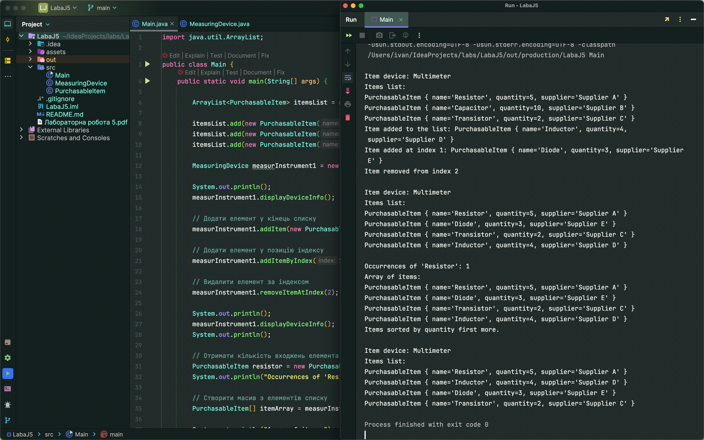

# Лабораторна робота № 5 Робота з колекціями. Java

## Мета лабораторної роботи –
Придбання навичок в застосуванні колекцій з бібліотеки Java.

## Вхідні дані до лабораторної роботи:
Студент створює колекцію певного типу з об’єктів класу відповідно свого
індивідуального завдання до лабораторної роботи №2 і реалізує множину функцій відповідно до свого індивідуального завдання до лабораторної роботи №5. Таблиця 4 - Список функцій для виконання лабораторної роботи.

## Висновок: 
На даній лабораторній роботі придбав навички в застосуванні колекцій з бібліотеки Java.

**З таким вмістом в Main:**
```java
import java.util.ArrayList;

public class Main {
    public static void main(String[] args) {

        ArrayList<PurchasableItem> itemsList = new ArrayList<>();

        itemsList.add(new PurchasableItem("Resistor", 5, "Supplier A"));
        itemsList.add(new PurchasableItem("Capacitor", 10, "Supplier B"));
        itemsList.add(new PurchasableItem("Transistor", 2, "Supplier C"));

        MeasuringDevice measurInstrument1 = new MeasuringDevice("Multimeter", itemsList);

        System.out.println();
        measurInstrument1.displayDeviceInfo();

        // Додати елемент у кінець списку
        measurInstrument1.addItem(new PurchasableItem("Inductor", 4, "Supplier D"));

        // Додати елемент у позицію індексу
        measurInstrument1.addItemByIndex(1, new PurchasableItem("Diode", 3, "Supplier E"));

        // Видалити елемент за індексом
        measurInstrument1.removeItemAtIndex(2);

        System.out.println();
        measurInstrument1.displayDeviceInfo();
        System.out.println();

        // Отримати кількість входжень елемента
        PurchasableItem resistor = new PurchasableItem("Resistor", 5, "Supplier A");
        System.out.println("Occurrences of 'Resistor': " + measurInstrument1.countItemOccurrences(resistor));

        // Створити масив з елементів списку
        PurchasableItem[] itemArray = measurInstrument1.toArray();

        System.out.println("Array of items:");
        for (PurchasableItem item : itemArray) {
            System.out.println(item);
        }

        // Відсортувати список за кількістю продуктів
        measurInstrument1.sortItemsByQuantityFirstMore();
//        measurInstrument1.sortItemsByQuantity();

        System.out.println();
        measurInstrument1.displayDeviceInfo();

    }
}

```

**Результат:**



Лінк на [ГуглДокумент звіту](https://docs.google.com/document/d/1Hb6khMGqdKHHevKUoVMhq4HHGmozlam4UoJo2CQ8uBI/edit?usp=sharing).